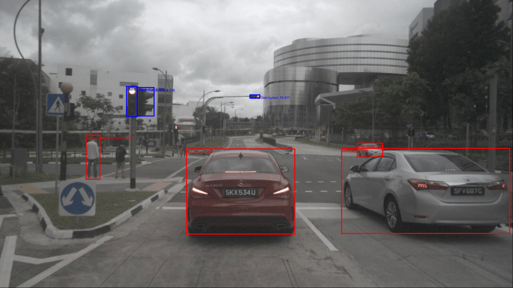

## [ITSC 2026] Energy-Flow Modeling: Integrating Energy-Based Models and Flow Matching for Robust Open-Set Camera Object Detection

Official repository and implementation for the 2026 ITSC paper "Energy-Flow Modeling: Integrating Energy-Based Models and Flow Matching for Robust Open-Set Camera Object Detection" by Vladimir Lunic and Michael Buchholz

[]() []()



### Abstract
This paper introduces Energy-Flow Modeling (EFM), a framework that integrates energy-based modeling with flow matching for robust open-set recognition. By defining velocities as the negative gradients of a scalar energy function, EFM bypasses the autoencoder-like architectures typically required by flow matching (FM). This formulation leverages the FM loss to avoid the computationally expensive Langevin dynamics inherent in traditional energy-based models, speeding up training and inference. Furthermore, we shift from a single data distribution to multiple start and end distributions that define a unified velocity field across an energy plane. By using point masses as end distributions and defining them as class prototypes, we move beyond traditional probability outputs and instead use distances to prototypes as a metric for class membership. We apply our framework to extend the Faster R-CNN detector. We then evaluate this model on standard OOD benchmarks: FPR95, AUROC, and AUPR, demonstrating that EFM consistently outperforms the baseline Faster R-CNN without our proposed extension, in anomaly detection, while keeping high accuracy scores.

### Installation

#### 1. Create a virtual environment
For example:
```shell
virtualenv .venv --python=3.12
```

#### 2. Install dependencies
```shell
pip install -r requirements.txt
```

### Data Preparation

#### 1. Download NuImages and COCO
Download data from these links. Unzip and place into a directory. For the paper the datasets were placed within the root directory of the repository within the `dataset` directory. This is where the configurations also expect the data to be.

[NuImages official site](https://www.nuscenes.org/nuimages).

[COCO official site](https://cocodataset.org/#home)

#### 2. Export NuImages and COCO frames
The scripts `data/nuimg_export.py` and `data/coco_export.py` export the data into a format that is suitable for the methods implemented in the paper. The scripts will export data into the `dataset` directory with the name `dataset/<dataset>/<version>_frames`. Inside it you will find the configuration that exported the data, the data export log, `.pt` files with torch tensors and the index lookup table for each image in the dataset.

To run the NuImage export script:
```shell
python -m data.nuimg_export.py
```
By default the `--version` argument is set to `v1.0-mini`, but you can use any of the versions of NuImages. The `--labels` argument is by default set to `human.pedestrian.adult` and `vehicle.car`, but can be any set of labels defined by NuImages (also found on the offical site). This script will also export the class prototypes as the NuImages dataset is used as the training dataset.

To run the COCO export script:
```shell
python -m data.coco_export.py
```
The `--version` argument is set to `val2017` by default, while the `--labels` are set to empty which exports all labels. The `--labels` are a list of labels as defined in the COCO dataset. The full list of COCO labels is found [here](https://tech.amikelive.com/node-718/what-object-categories-labels-are-in-coco-dataset/).

### Training

#### 1. Configurations
There are three main configurations that need to be defined before training.

The first one is regarding the Time-Dependent CNN that will be used for training the velocity field neural network. It is defined in the `nn/models/configs/cnn.cfg.yaml/` file. Each layer has to be defined with (at least) the non-optional parameters from the layer class, so that the model can be properly initialized. The example configuration used in the paper is defined by default in the configuration file for the CNN.

The second config is regarding the data that will be used and all the hyperparameters regarding data. It is found inside `nn/configs/data.cfg.yaml`. The configuration used in the paper is present by default.

Lastly the training config for defining all the hyperparameters regarding training. It is found inside `nn/configs/train.cfg.yaml`. There, the learning rate, epochs, losses, regularization coefficients and warmup epochs and additional loss kwargs are defined. The configuration used for the paper is present by default.

#### 2. Training
By running the `train.py` script, training is performed. The arguments required are the paths to the three configurations, which are by default set to paths defined in the previous section, and the name of the run. During training, a `runs` directory will be created with a subdirectory of the name of the run defined by the `--name` command line argument. Inside the run one can find all the checkpoints from the model's training, all the configs used for training the model, the run log, and the loss plots.

```shell
python -m nn.train --name=debug_run
```

#### 3. Post training
To compute the KDEs, after training the `post_train.py` script needs to be ran. The post train script expects the name of the run and the checkpoint from which to take the model for computing the KDEs.

```shell
python -m nn.post_train --run=debug_run --checkpoint=10
```
This will then create the `post_train.pt` file inside the run's directory inside which are the KDEs per class.

### Evaluation

#### 1. Configuration
To evaluate the model first fill out the `nn/configs/eval.cfg.yaml` with the required fields. Defining the run, the checkpoint, the dataset and the number of steps in the ODE solver. The configuration present in the file by default is the one used in the paper.

#### 2. Evaluation
Following that run the evaluation script:
```shell
python -m nn.eval --name=debug_eval
```
The script expects the path to the evaluation config, and is set to the path above by default. It also expects the name of the evaluation. Once done, the runs directory will get a subdirectory called `evals` in which the evaluation results will be saved in `.pt` files per batch processed.

### Faster R-CNN
The repository also provides the module for the Faster R-CNN used in the paper. It follows a similar structure to the one described in previous sections, with configurations, training and evaluations. Simply fill out the configurations and run scripts like with the EFM approach.


### License
This project is open-sourced under the AGPL-3.0 license. See the [LICENSE](LICENSE) file for details.

For a list of other open source components included in this project, see the file [3rd-party-licenses.txt](3rd-party-licenses.txt).

### Purpose
This software is a research prototype only and shall only be used for test-purposes. This software must not be used in or for products and/or services and in particular not in or for safety-relevant areas. It was solely developed for and published as part of the publication "Energy-Flow Modeling: Integrating Energy-Based Models and Flow Matching for Robust Open-Set Camera Object Detection" and will neither be maintained nor monitored in any way.

### Citation

```bibtex
bibtex here
```
